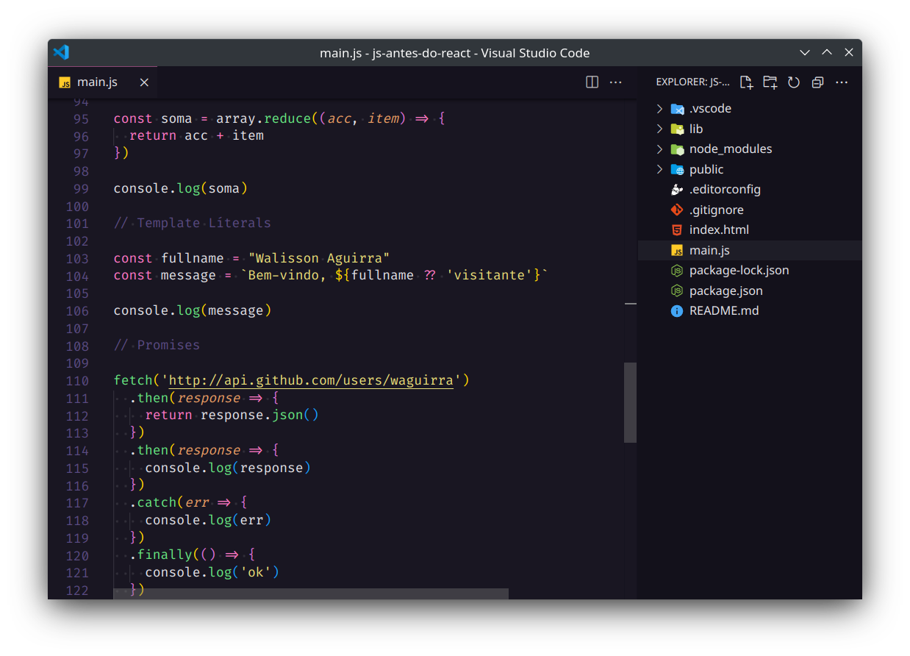

<h2 align="center"> TUDO que você deve estudar de JavaScript antes do React</h2>



Este repositorio contem meu "resumo" de estudo. básicamente são todas as funções e recursos do JavaScript apresentados no video [TUDO que você deve estudar de JavaScript antes do React](https://www.youtube.com/watch?v=37SwqREHRGI&list=TLPQMjcwMzIwMjMt9ljIfgC8KQ&index=6) da Rocketseat.

### Conteúdo
- Nullish Coalescing Operator
- Objetos
- Desestruturação
- Rest operator
- Short Syntax
- Optional Chaining
- Funções para arrays
- Template Líterals
- Promises
- ES Modules

### Guia rápido

1. Clone o projeto na sua maquina
```sh
git clone https://github.com/waguirra/js-antes-do-React && cd js-antes-do-React
```

2. Instale as dependencias do projeto
```sh
npm install
```

3. Execute o projeto

```sh
npm run dev
```

🎉 **Pronto!!!**

<!-- LICENSE -->
## License

Distribuído sob a licença GNU General Public License v3.0. Veja LICENSE para mais informações.
